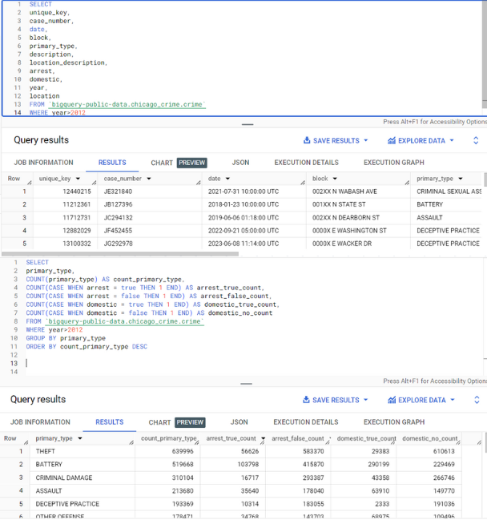
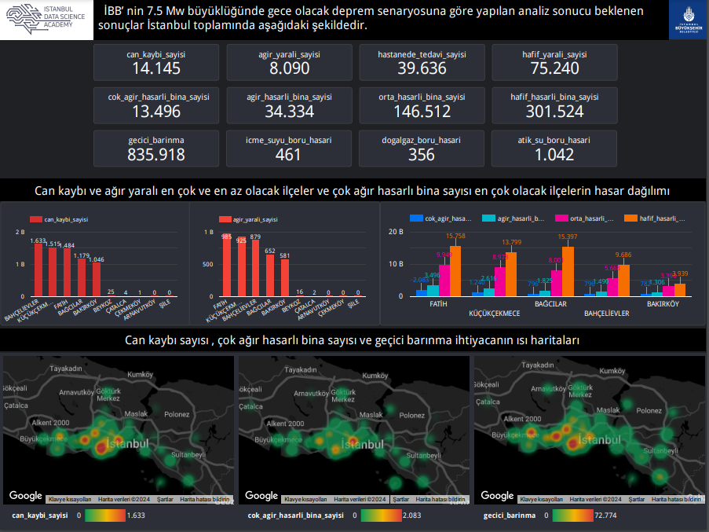
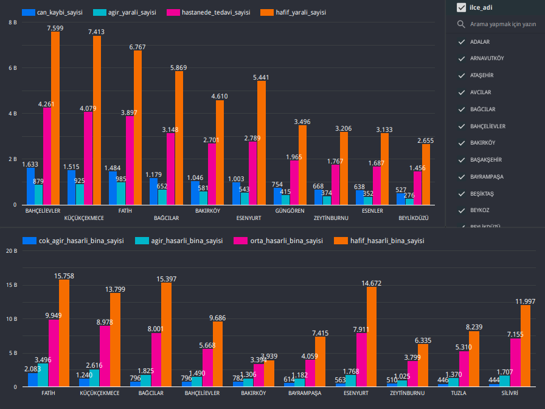
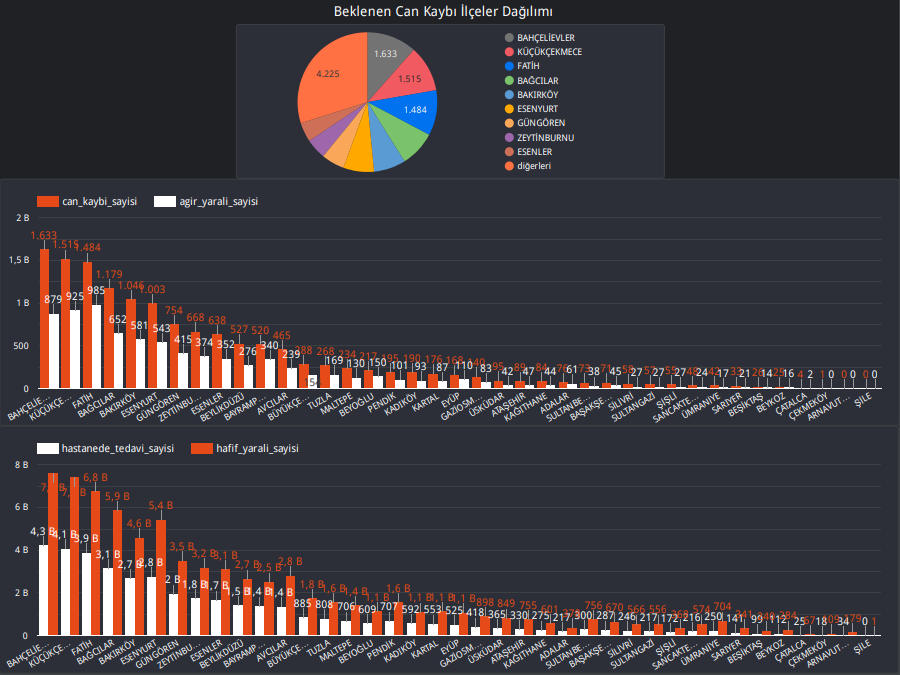
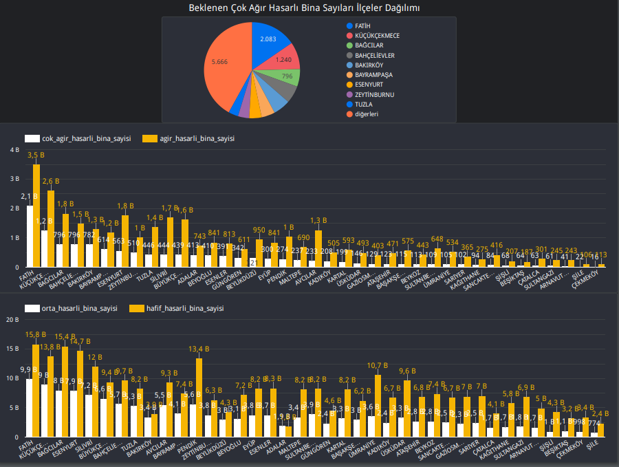

# Data Analyst Boostcamp V2 Reports

This repository contains reports of projects completed during the Data Analyst Boostcamp V2 organized by Google Cloud and Istanbul Data Science Academy.

## Chicago Crime Analysis

In this project, I conducted various SQL analyses using the public dataset of Chicago Crimes in the BigQuery environment. Subsequently, I created reports from these analyses using Looker Studio.

- [View Reports](https://lookerstudio.google.com/reporting/1c0a926f-e133-477f-9cf1-dbcd7aa7268c)

## Istanbul Earthquake Scenario Analysis

In this project, I generated reports using the dataset of Istanbul Earthquake Scenario Analysis Results from the Istanbul Metropolitan Municipality Open Data Portal. I performed various SQL analyses on BigQuery and visualized the results.

- [View Reports](https://lookerstudio.google.com/reporting/12153dba-378a-41f9-854e-efcc3b61cf3c)

